# Description
PoC keycloak with a client configured resource permissions

## Configuration
To create a client that control permissions we must to follow these steps:

- Create a realm with namelled **poc**
Create a realm to group all security entities: client, roles and permissions

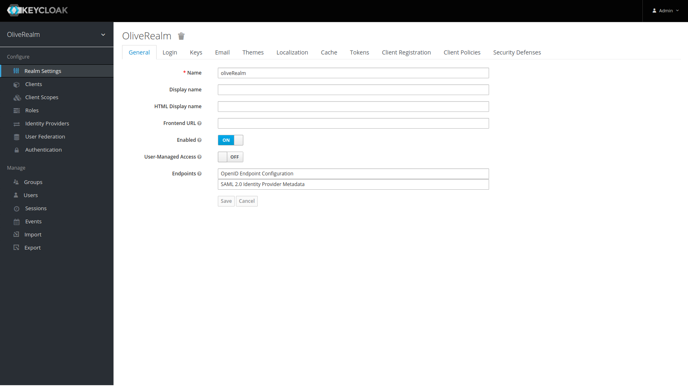

- Create a client with cliend id: **backend-permission**
We must create a client of type confidential and active the Authorization flag lñike this

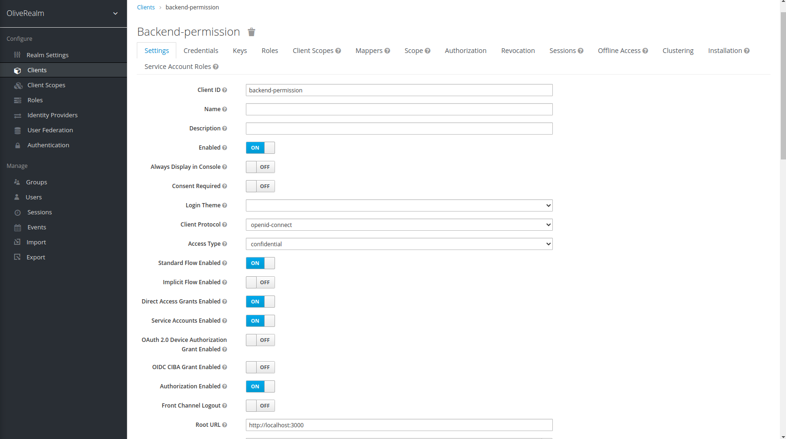

- Create the roles
Now we must create three roles for the realm with these names:

  **admin**
  **operator**
  **user**

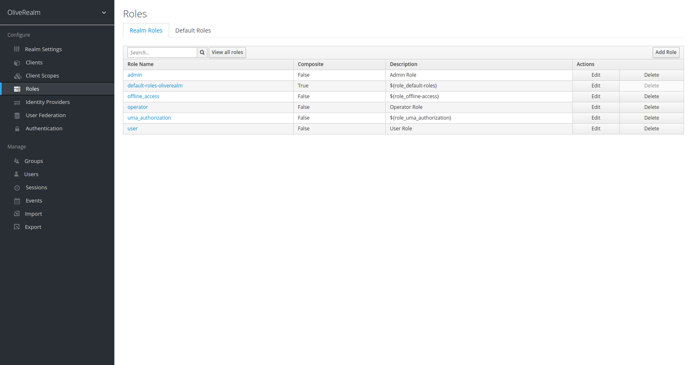

- Create the users

Now we must create three users attached to these roles with this usernames and password test

  **admin** user with admin role attached
  **operator** user with opererator role attached
  **user** with user role attached

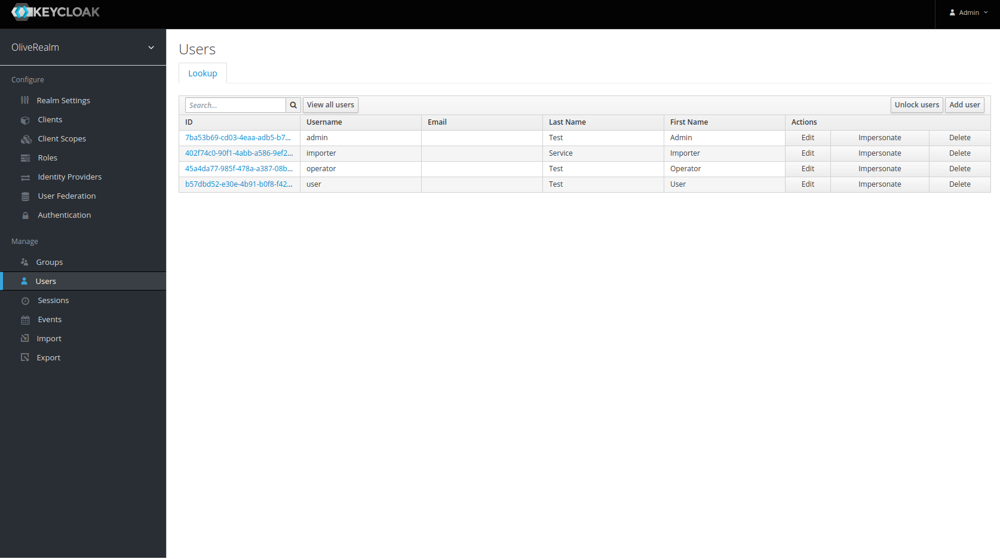

- Define the permissions table

Now we must create the UMA entities to authorize our endpoints using permissions: scopes, resources, policies and permissions entities

The permission table that we configured in the client will be:

| Scope                      | Resource      | Policy          | 
|----------------------------|:-------------:|----------------:|
| read, create, edit, delete | client        | Admin Policy    | 
| read, edit                 | client        | Operator Policy |
| read                       | client        | User Policy     |

- Create the scopes

First create the scope for all resources. We list all scopes and the verbs related with them:

  **view**: capacity list resources (GET)
  **create**: capacity to insert resources (POST)
  **edit**: capacity to update resources (PUT)
  **delete**: capacity to delete resources (DELETE)

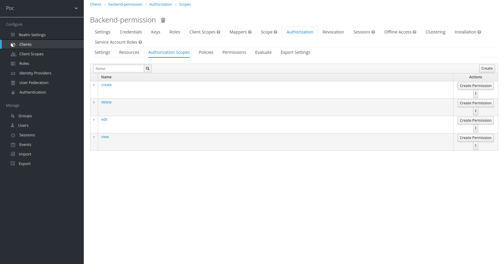

- Create the resources

Second we create a resource called client that represent the methos /clients/* endpoint. We must attached all scopes previously configured to this resource


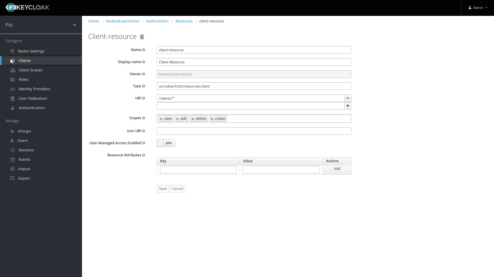

- Create the policies

Third we creae three policies on for each role created previosuly. These policies will be:

  **admin**: Admin Policity attached to Admin Role
  **operator**: Operator Policity attached to Operator Role
  **user**: User Policity attached to User Role

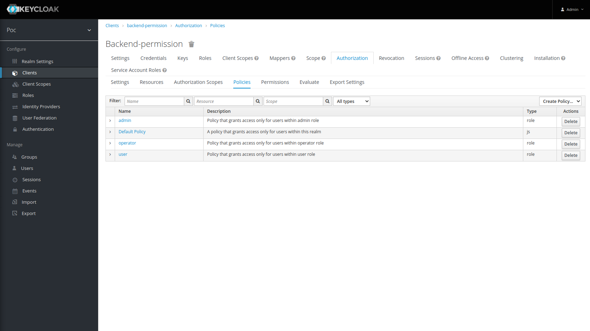
  
- Create the permissions

Finally we can create four permissions attached to the resource and each scope previously created. All of these permission must follow a Affirmative Decision Strategy. These permissions are:

  **client-view**: Permission atatched to client resource for scope view
  **client-create**: Permission atatched to client resource for scope create
  **client-edit**: Permission atatched to client resource for scope edit
  **client-delete**: Permission atatched to client resource for scope delete

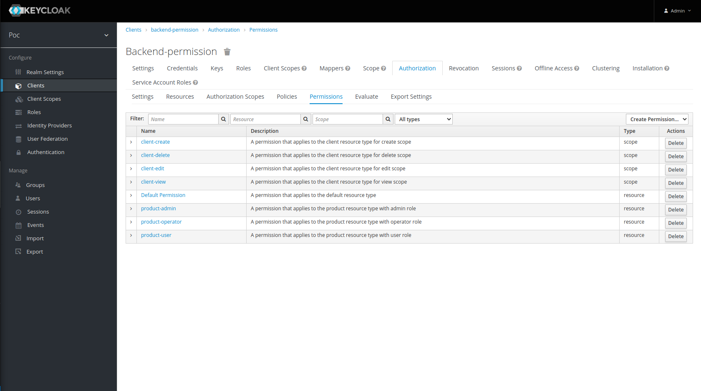

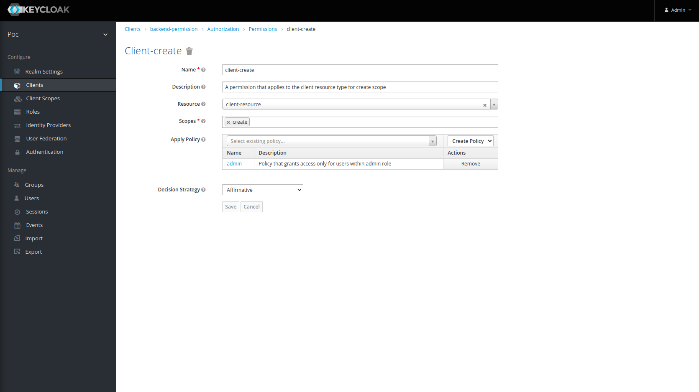

- Now we could validate all of this configuration using a keycloak tool called **evaluate**

--> For example we could check all scoped permied for a **admin actor**:


The result it's:


--> For example we could check all scoped permied for a **operator actor**:

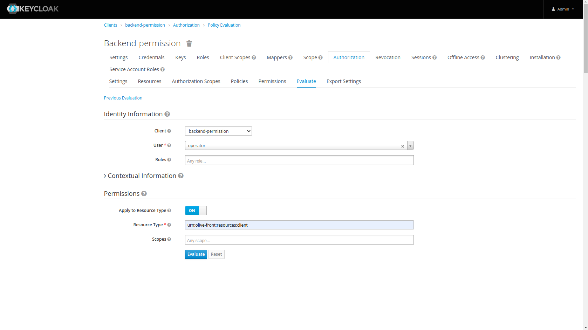

The result it's:

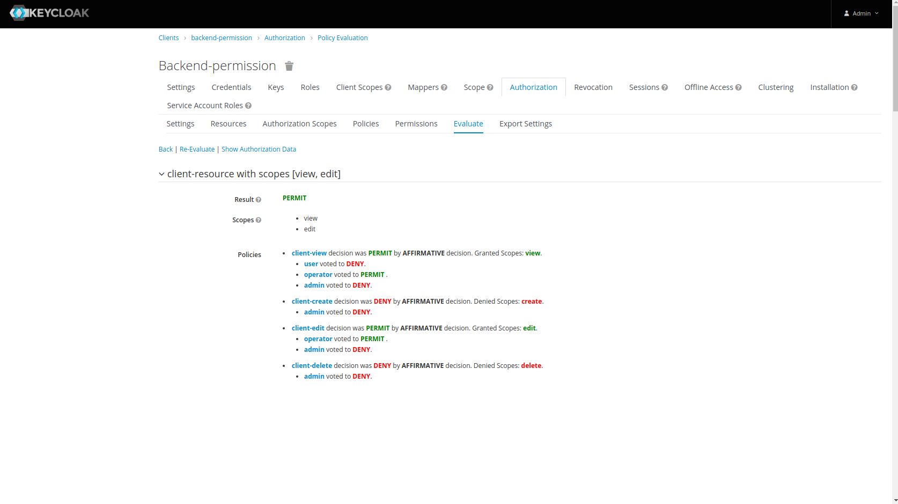

--> For example we could check all scoped permied for a **user actor**:


The result it's:

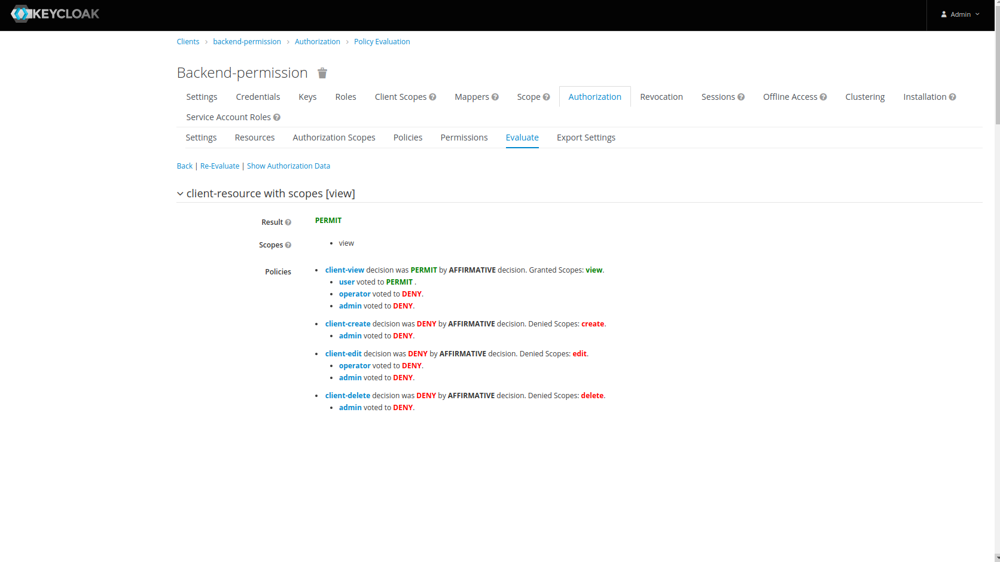

## Debug

Before validate the client resources from keycloak we are going to debug our client using Postman

-> First we login with Admin user

```shell
http://localhost:8080/auth/realms/poc/protocol/openid-connect/token

Content-Type: application/x-www-form-urlencoded
client_id: backend-permission
client_secret: 28nXT8EyAfH7h66YS3fOCsLhojfY4x6N
grant_type: password
username: admin
password: admin
```

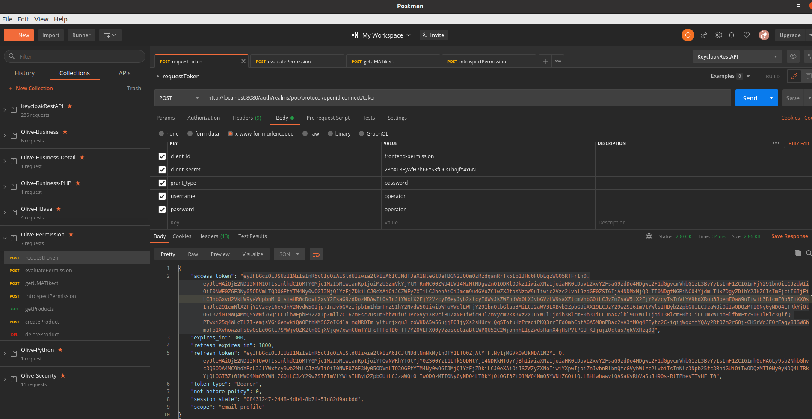

-> Second we evaluate the create scope for example


```shell
http://localhost:8080/auth/realms/poc/protocol/openid-connect/token

Bearer Token: Access Token obtained in the previous step

Content-Type: application/x-www-form-urlencoded
audience: backend-permission (the same as client_id)
grant_type: urn:ietf:params:oauth:grant-type:uma-ticket
permission: client-resource#create (RESOURCE_NAME#SCOPE_NAME)
response_mode: decision (reseume reponse)
```

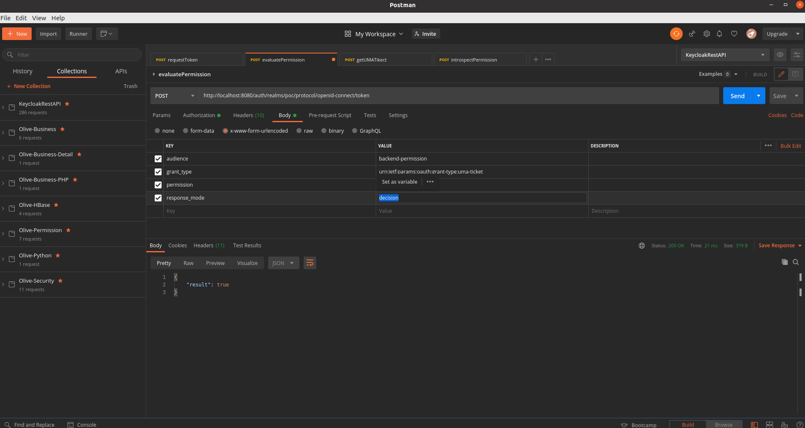

-> If Login with user actor and obtain a new access token and check again the same resource/scope result we obtain this result

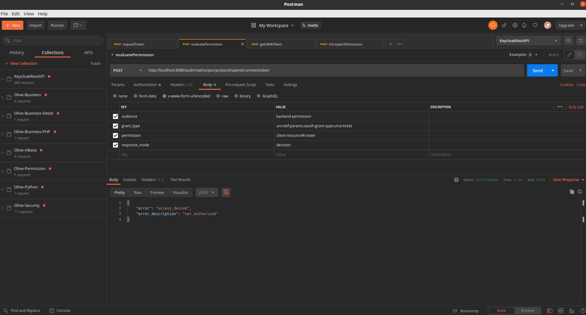

Other request is recover all permissions of the operator user for example

```shell
http://localhost:8080/auth/realms/poc/protocol/openid-connect/token

Content-Type: application/x-www-form-urlencoded
audience: backend-permission (the same as client_id)
grant_type: urn:ietf:params:oauth:grant-type:uma-ticket
```

We obtain a UMA-Token and JWT with this information

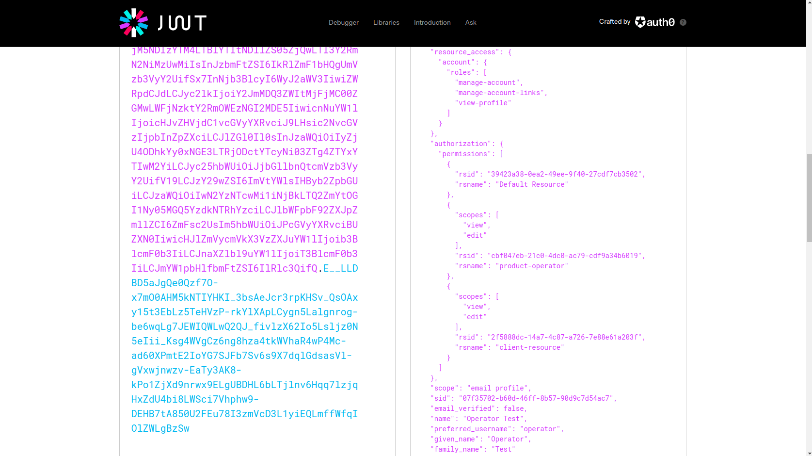

# Exports
- We could impot the keycloak realm
- We could import the REST Postman Endpoints